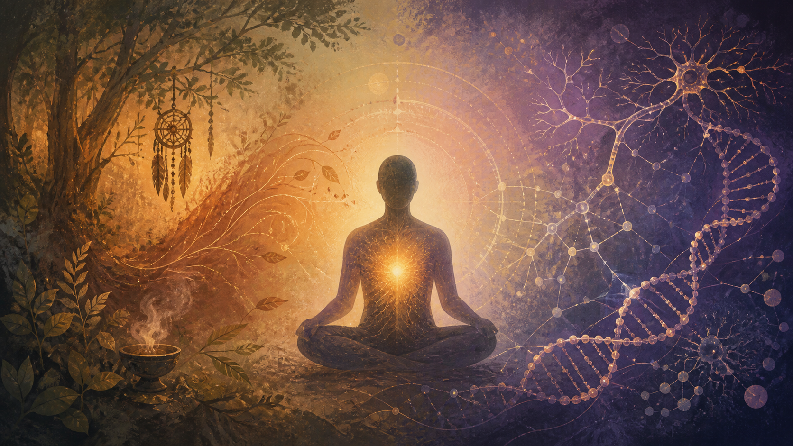

Už pětadvacet let se věnuji šamanství, práci s vědomím a léčení. Nezačínal jsem u odborných studií ani u potřeby někomu něco dokazovat. Začínal jsem u lidí, u jejich příběhů a u vlastní zkušenosti. Znovu a znovu jsem pozoroval, že způsob, jakým člověk prožívá sebe a svůj život, se nějakým způsobem propisuje také do jeho těla.

Přibližně před třinácti lety z této praxe vzniklo Vědomé uzdravení. Nebyl to systém sestavený od psacího stolu. Vyrůstal postupně z toho, co fungovalo, co bylo možné opakovat a co lidem pomáhalo měnit jejich vnitřní nastavení. Jako člověk s technickým zázemím mám přirozenou potřebu hledat souvislosti a skládat jednotlivé zkušenosti do srozumitelného celku. Intuice pro mě není opakem systému. Jsou to dva různé způsoby, jak se dívat na stejnou skutečnost.

Právě proto mě dnes zajímá, jak se některá stará pozorování potkávají s poznatky moderní vědy. Věda a šamanství vycházejí z odlišných způsobů poznávání, přesto se na mnoha místech dotýkají stejných souvislostí. Věda stále přesněji popisuje vazby mezi prostředím, myslí, mozkem a tělem, se kterými šamanská praxe pracuje odedávna svým vlastním jazykem.

## Myšlenka, které tělo naslouchá

Jedním ze základů Vědomého uzdravení je záměr. Záměr není letmé přání ani věta, kterou člověk bezmyšlenkovitě opakuje. Je to jasné vnitřní rozhodnutí, kterému věnuje pozornost, emoci a následně také své jednání.

Myšlenka formuje fyzickou realitu. Není to však jen imaginární představa ani způsob, jak na člověka přenést vinu za jeho nemoc. Je to praktický princip: naše představy, očekávání a přesvědčení ovlivňují, čeho si všímáme, jak reagujeme na stres, jak zacházíme se svým tělem a jaké kroky jsme schopni opakovat každý den. Tělo na tento celek odpovídá.

Známe to i z opačné strany. Když člověk dlouho žije ve strachu, tělo se podle toho zařídí. Když stále očekává bolest nebo neúspěch, jeho nervový systém zůstává v pohotovosti. Jestliže tedy dokážeme nevědomý příkaz postupně proměnit, může se změnit i prostor, ve kterém tělo hledá rovnováhu.

Ve Vědomém uzdravení proto pracuji s jednadvacetidenním cyklem. Ne proto, že by se přesně jednadvacátý den v mozku přepnul nějaký tajný vypínač. Každý člověk je jiný a věda ukazuje, že vytváření návyků může trvat výrazně kratší i delší dobu. Jednadvacet dní je pro mě použitelný základ: dost dlouhý na to, aby člověk překročil první odpor, a dost krátký na to, aby se k praxi skutečně zavázal. Někdy je potřeba pokračovat déle. Podstatné není magické číslo, ale pravidelnost.

## Epigenetika: geny nejsou celý příběh

Ještě relativně nedávno převládala zjednodušená představa, že DNA je hotový plán a člověk může jen sledovat, co se podle něj stane. Epigenetika tento obraz zpřesnila. Ukazuje, že aktivita genů je regulována a že ji mohou ovlivňovat podmínky, ve kterých organismus žije – například výživa, toxické látky, dlouhodobý stres nebo další vlivy prostředí. Samotná sekvence DNA se přitom měnit nemusí.

To znamená, že naše biologie není izolovaný stroj. Neustále vede rozhovor s prostředím, ve kterém žijeme. A součástí tohoto prostředí je také rytmus našeho života, vztahy, pocit bezpečí, spánek, pohyb a způsob, jakým se vyrovnáváme se stresem.

Šamanství pro tento rozhovor používá jiná slova. Mluví o rovnováze, ztrátě síly, vztahu k sobě a ke světu. Epigenetika přináší biologický pohled na vztah organismu a prostředí, šamanství jej vnímá skrze prožitek a celistvost člověka. Obě perspektivy připomínají důležitou věc: nejsme jen pasivními nositeli předem určeného osudu. Na podmínkách, které pro své tělo vytváříme, záleží.

## Neuroplasticita: opakováním vzniká cesta

Neuroplasticita je schopnost mozku měnit svou činnost a uspořádání v reakci na zkušenost a trénink. To, co opakujeme, se může postupně stávat dostupnější, snazší a automatičtější. Platí to pro pohyb, pozornost, reakci na určitou situaci i pro některé způsoby uvažování.

Proto vizualizaci nevnímám jako „myšlení na hezké věci“. Dobrá vizualizace je soustředěný nácvik vnitřního stavu. Člověk si nepředstavuje jen obrázek zdraví; učí se vnímat, jak by dýchal, jednal a rozhodoval se, kdyby už nebyl zcela řízen starým programem. Mentální nácvik posiluje nové nervové spoje a propojuje vnitřní obraz s emocí, tělesným prožitkem a konkrétním jednáním.

Každodenní praxe dává novému vzorci šanci zesílit. Jednadvacetidenní cyklus je první vychozená pěšina. Pokud je stará cesta hluboká, je třeba po nové pěšině chodit déle. Změna nevzniká jedním velkým prohlášením, ale mnoha malými návraty ke zvolenému směru.

## Kvantový rámec: vědomá volba možnosti

Kvantová fyzika přinesla obraz reality, která na své nejhlubší úrovni není pevnou a předem hotovou kulisou. Vlnová funkce popisuje množinu možných výsledků a při měření se setkáváme s jedním konkrétním stavem. Pojmy jako pozorovatel nebo kolaps vlnové funkce mají ve fyzice svůj přesný význam; pro mě jsou zároveň podnětným rámcem pro práci s vědomím.

Vědomé uzdravení pracuje s podobným pohybem na úrovni lidské zkušenosti. Člověk přestává svou pozorností, emocemi a každodenním jednáním potvrzovat pouze dosavadní stav. Ze škály možností vědomě volí směr zdraví a učí se v něm postupně zakotvit. Kvantový rámec mi připomíná, že ani náš osobní příběh nemusí být jedinou možnou budoucností.

Přesun ke stavu zdraví není jednorázové přání. Je to vědomá volba směru, kterou člověk znovu a znovu potvrzuje svou pozorností, rozhodováním i tělesným prožitkem. Vnitřní obraz se stává kompasem a každodenní praxe způsobem, jak podle něj skutečně jít.

## První krok

Nemusíte dnes přijmout celý systém ani uvěřit každému slovu. Zkuste jeden konkrétní krok.

Vyberte si oblast těla nebo života, ve které chcete podpořit změnu. Každý den po dobu jednadvaceti dnů si dopřejte několik nerušených minut. Zklidněte dech. Vnímejte současný stav bez boje a bez obviňování. Potom si co nejkonkrétněji představte stav, ke kterému směřujete. Nejen jako obraz, ale jako prožitek: jak se v něm vaše tělo cítí, co v něm děláte jinak a jaký jeden skutečný krok můžete udělat ještě dnes. Ten krok potom udělejte.

Pozorujte, co se mění. Možná nejprve ne v příznacích, ale ve vašem vztahu k sobě, v odvaze požádat o pomoc nebo ve schopnosti být důsledný. I to je pohyb.

Vědomé uzdravení je způsob, jak se znovu stát aktivním účastníkem svého života a vlastního uzdravení. Vrací člověku vědomý vztah k sobě, k tělu i ke směru, kterým se rozhodl jít.

Věda a šamanství nemluví stejným jazykem. Někdy si ani nekladou stejné otázky. Ale tam, kde obě cesty obracejí pozornost ke vztahu mezi zkušeností, prostředím, mozkem a tělem, vzniká prostor pro setkání. A právě v tomto prostoru může začít první vědomý krok ke změně.

*Článek původně vyšel na [mém šamanském blogu](https://saman.jancejka.cz/posts/setkani-pristupu-k-uzdraveni/).*

<aside class="not-prose my-10 rounded-2xl border border-accent bg-white p-6 sm:p-8" aria-labelledby="mira-cta-title">
  
Váš další krok

  <h2 id="mira-cta-title" class="mt-3 font-serif text-2xl font-bold text-primary-dark">Promluvte si o praxi s Mirou</h2>
  
Mira je AI průvodkyně uzdravením a zná obsah knihy Magie Vědomého Uzdravení. Můžete se jí ptát na 21denní postup, komunikaci s tělem, záměr a vizualizaci.

  

    <a
      class="inline-flex min-h-11 items-center rounded-lg bg-primary px-6 py-3 font-semibold text-white no-underline transition-colors hover:bg-primary-light hover:no-underline"
      href="https://t.me/uSkyCzBot?start=UZDRA20"
      target="_blank"
      rel="noopener noreferrer"
      data-umami-event="chatbot-open"
      data-umami-event-bot="vedome-uzdraveni"
      data-umami-event-placement="blog-setkani-pristupu-k-uzdraveni"
    >
      Otevřít Miru v Telegramu
       (otevře se v novém okně)
    </a>
    <a class="inline-flex min-h-11 items-center font-medium text-primary underline underline-offset-4" href="/mira">Více o Miře →</a>
  

  
Prvních 20 zpráv máte zdarma. Další zprávy si můžete dokoupit.

  
Mira je AI, může se mýlit a nenahrazuje lékařskou péči.

</aside>
